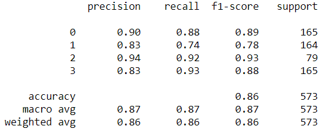
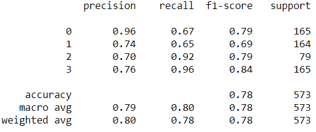
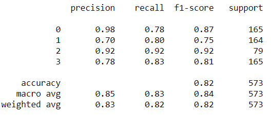

# Brain Tumor Classification

The aim of this project is to find the best model for classifying different types of brain tumors from an open source kaggle dataset. The data used for this project can be found [here](https://www.kaggle.com/sartajbhuvaji/brain-tumor-classification-mri). The data consists of 3264 MRI images (converted to JPEG format) of patients with 1. glioma tumor 2. meningioma tumor 3. pituitary tumor and 4. no tumor. The approach I am using for classification is transfer learning. 

These are the pre-trained models used so far in the analysis 

### Vision Transformer

### InceptionV3

### Resnet50

In the future I will be adding more models to compare the results 
